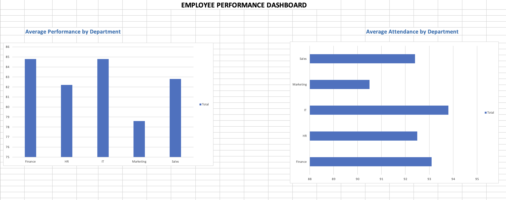
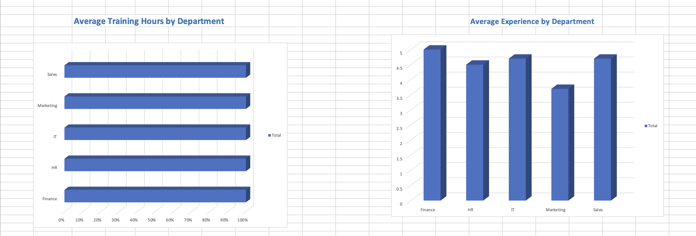
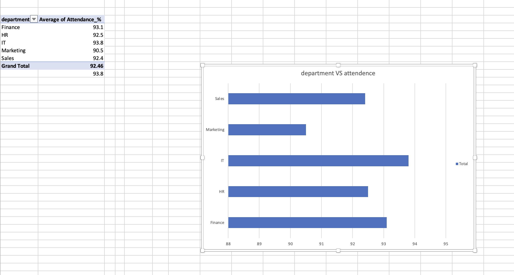
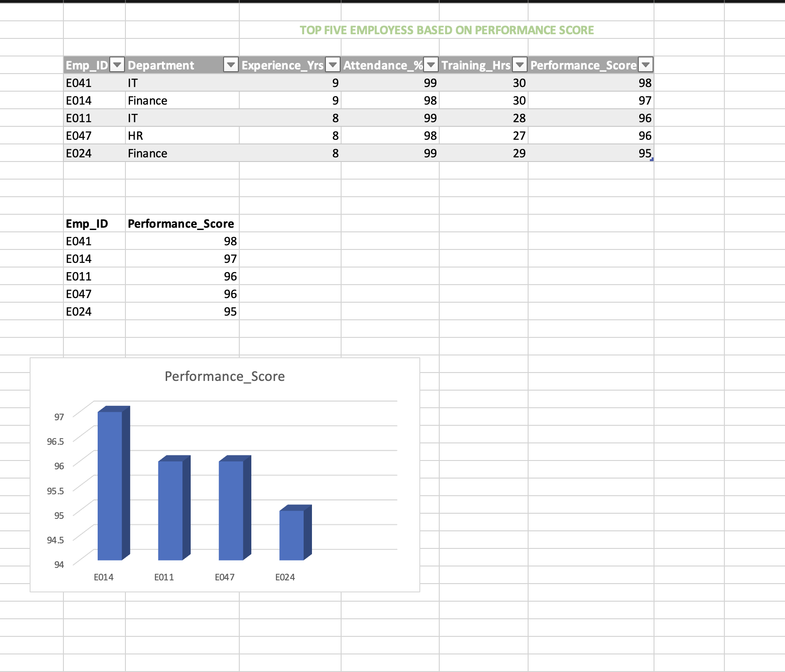
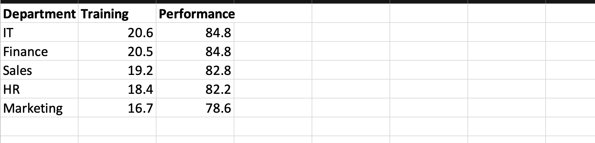
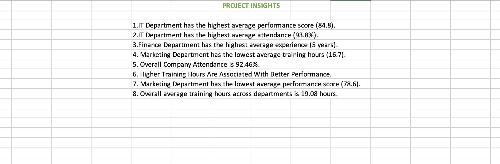

# Employee Performance Analysis Dashboard

## 📌 Project Overview
This project analyzes employee performance data using Microsoft Excel. The objective is to identify trends in performance, attendance, training hours, and experience across different departments through data analysis and visualization.

## 🎯 Objectives
- Analyze employee performance by department.
- Compare attendance across departments.
- Evaluate average training hours.
- Analyze average experience levels.
- Identify the top-performing employees.
- Present findings using an interactive dashboard.

## 🛠️ Tools Used
- Microsoft Excel
- Pivot Tables
- Pivot Charts
- Dashboard Design

## 📊 Dashboard Preview

## 📊 Dashboard Preview

### Employee Performance Dashboard

### Performance by Department

### Attendance by Department

### EDA Dataset Overview

### EDA Questions

### Project Insights

## 📈 Key Insights
- IT department has the highest average performance score (84.8).
- IT department has the highest average attendance (93.8%).
- Finance department has the highest average experience (5 years).
- Marketing department has the lowest average training hours (16.7).
- Overall company attendance is 92.46%.
- Higher training hours are associated with better performance.
- Marketing department has the lowest average performance score (78.6).
- Overall average training hours across departments is 19.08 hours.

## 📂 Project Files
- Dashboard.png
- Project_Insights.png
- EDA_Findings.png

## 👩‍💻 Author
Mohana Gayatri
